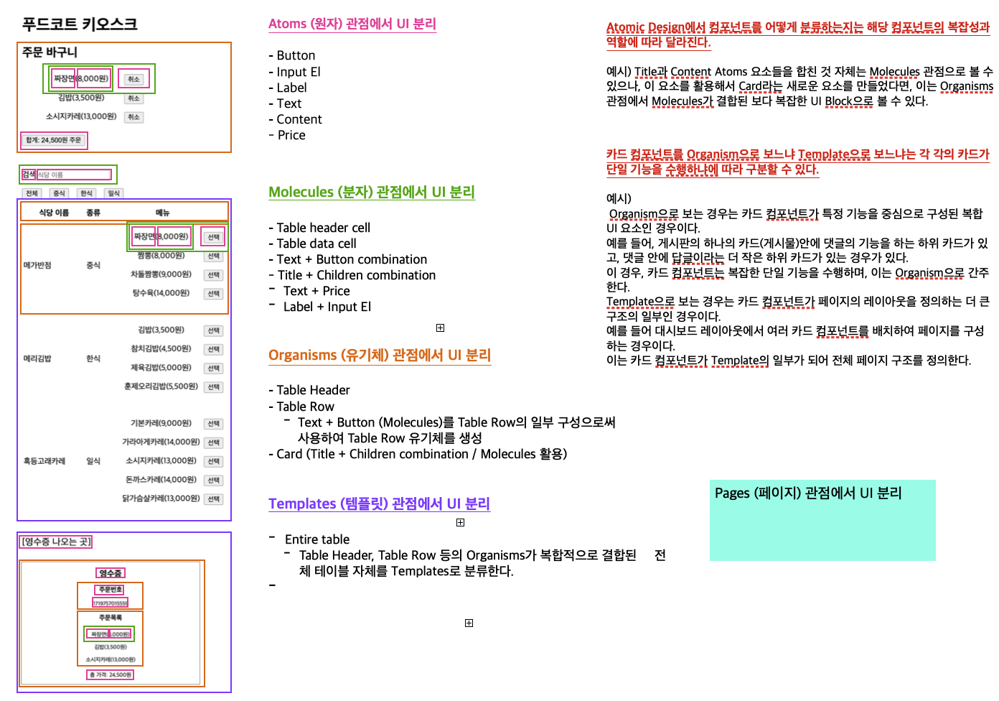

### 7주차 회고

이번 7주차에는 React Router에 대해서 학습을 하였다.

가장 근본이 되는 Web APIs에서 제공되는 웹 브라우저에서 페이지 라우팅시 사용되는 기능들에 대해서 이해하고, 이러한 기능들이 React에서는 어떤식으로 제공이 되는지 사용해보았다.

이전에 React를 학습했을때에는 그냥 "페이지를 특정 페이지로 이동하기 위해서는 이렇게 처리하면 되고, 이런식으로 경로와 라우팅되는 페이지 컴포넌트를 매핑해서 잡아주면 되는구나"라고 단편적으로 React 라이브러리의 사용법에 치중해서 공부하고, 개발을 해왔던 것 같다.

하지만, 이번 기회에 다시 React에 대해서 학습을 진행하면서 React와 같은 SPA 프레임워크에서 제공되는 여러 기능들이 본래 Web APIs에서 제공되는 기능을 좀 더 개발 할 때 구현하기 편하게 나온 기능들이라는 점을 인지하며 공식문서와 강의에서 참고하라고 올려주신 여러 유익한 자료 링크의 내용들을 읽어보며 학습할 수 있었다.

업무를 하면서 즉각적으로 빠르게 사용법만 알고 사용하는 경우가 대부분이라 해당 기능이 어떤 기능에서 파생이 되어서 생겨났고, 기술이 나오게 된 배경에 대해서 간과하며 개발을 해온 점을 반성하게 된 좋은 한 주였던 것 같다.

이번 7주차 수업을 들으며, 물론 5, 6주차 과제도 마찬가지지만, 이 테스트 코드를 작성하는 부분이 아직 미흡하다고 생각해서 다시 TDD쪽 강의들을 한 번 더 보며, 내가 개발을 하게 된다면 어떤 순서로 어떻게 적용을 해볼 것인지 테스트 코드 작성 부분을 집중해서 다시 강의를 보며, 나만의 Test code cheatSheet를 작성해보고 있는 중이다.

[테스트 코드 작성 CheatSheet](/Test/TestCodePractice.md)

완성이 되면, 반복해서 CheatSheet에 작성한 내용들을 반복하고, 또 반복한 후에 아직 제출하지 못한 5, 6주차 과제를 비롯해서 이번 7주차 과제까지 같이 제출을 할 것이다.

뭔가 단순히 과제를 제출하기 위해 억지로 하기보다는 뭔가 정리가 되고, 좀 더 완성도 있는 과제 제출을 하고 싶다..

아 그리고 React스럽게 생각하며 컴포넌트를 쪼개는 연습을 회사 점심시간에 틈나는대로 배웠던 UI들을 아이패드에 놓고 연습해보고 있다.

이제 페이지 하나를 작성하더라도 꼼꼼하게 UI를 분석하고, 가르쳐주신대로 TDD 방식을 적용해서 반복 학습을 해야겠다.
